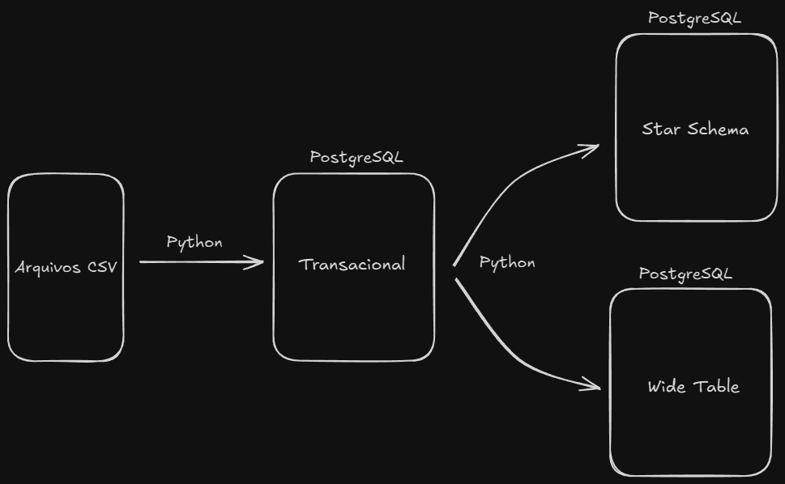
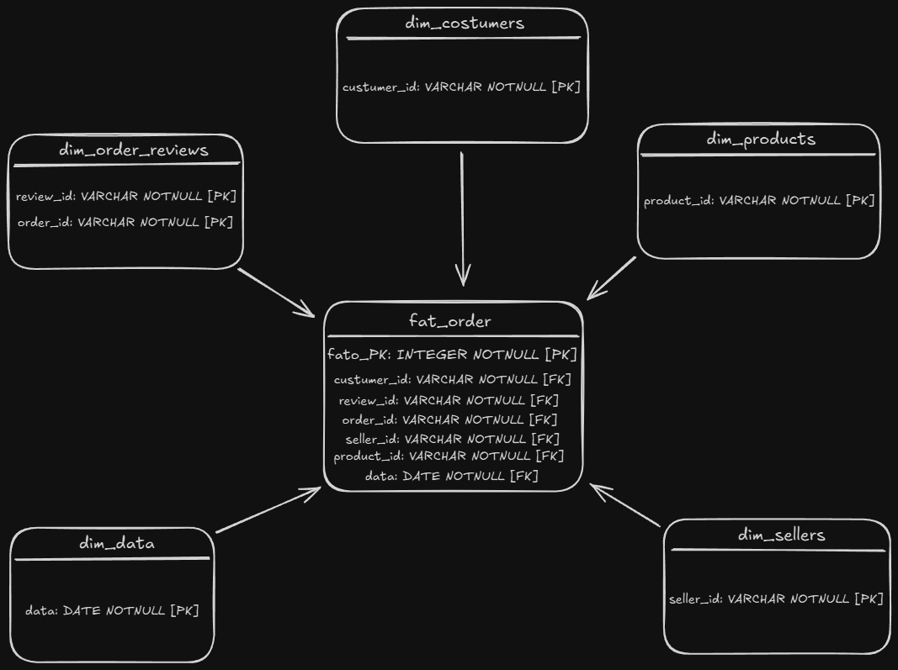

# Projeto Final - Data Prep & Transformation

## Sobre o Projeto

Este projeto teve como objetivo a criação de um pipeline de dados para transformar uma base transacional em um Star Schema e uma Wide Table, proporcionando uma estrutura otimizada para análises e consultas.

Todo o pipeline foi desenvolvido utilizando containers Docker, orquestrados por meio de um único arquivo docker-compose para simplificar a execução e o gerenciamento.

Dataset utilizado: [Olist](https://www.kaggle.com/datasets/olistbr/brazilian-ecommerce?resource=download&select=olist_customers_dataset.csv)

### Estrutura do Projeto:

- **Base de Dados Transacional:** O ponto de partida do pipeline, contendo os dados brutos.
- **Pipeline:** Processos de extração, transformação e carregamento (ETL), que geram o Star Schema e a Wide Table.
- **Star Schema:** Estrutura dimensional com tabelas relacionadas para otimização de consultas analíticas.
- **Wide Table:** Uma tabela ampla consolidada para simplificação de análises.
- **Docker Compose:** Um único arquivo [docker-compose](compose.yml) para orquestrar todos os serviços necessários.

#### Arquitetura:



## Arquitetura Star Schema

Foi utilizado o Power Architect para modelar e organizar os relacionamentos necessários para a construção do Star Schema. A arquitetura ficou dividida pelas seguintes dimensões e fato:



*Foi criada a dimensão dim_data para facilitar e otimizar as análises temporais.*


Essa estrutura foi pensada para garantir flexibilidade e eficiência nas futuras análises de dados.

## Arquitetura Wide Table

A arquitetura Wide Table ficou definida com uma única tabela contendo todas as informações da base.

Essa estrutura foi projetada para simplificar consultas e aumentar a performance analítica, consolidando dados em uma única tabela, ideal para cenários de leitura intensiva e análises rápidas.


## Como Executar o Projeto

### Pré-Requisitos
  - Ter o Docker e o Docker Compose instalados no sistema.
  - Um client que suporte conexões com PostgreSQL (ex.: DBeaver, pgAdmin, ou qualquer outro sistema que suporte PostgreSQL).

### Passo a Passo

1.  **Clone o repositório**:
     ```bash
       git clone https://github.com/andre-ls/mack-etl.git
       cd mack-etl
     ```
   
2. **Inicie o ambiente com o Docker Compose**:
   ```bash
   docker-compose up
   ```
Isso inicializará todos os containers necessários para o projeto.

3. Conecte-se ao banco de dados: Utilize qualquer sistema ou cliente que suporte PostgreSQL para acessar os dados transformados:

    - Host: localhost (ou o IP do servidor, caso não esteja local).
    - Porta: 5432 (ou a porta definida no docker-compose.yml).
    - Usuário: O usuário configurado no container (ex.: postgres).
    - Senha: A senha definida no arquivo docker-compose.yml.
    - Database: Nome do banco de dados configurado no pipeline (ex.: star_schema ou wide_table).

4. **Finalize os containers**:
   ```bash
   docker-compose down
   ```


