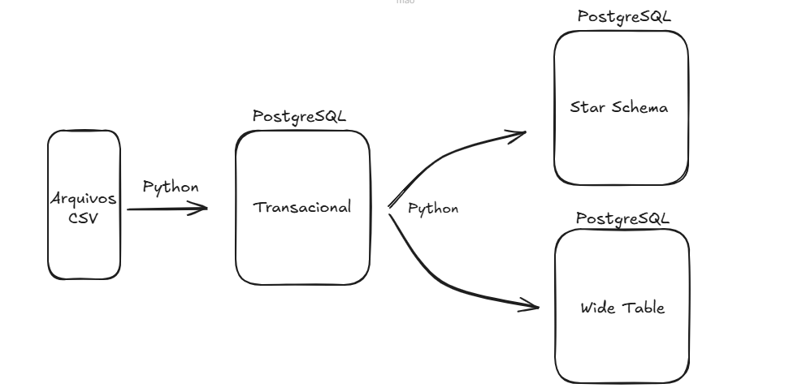
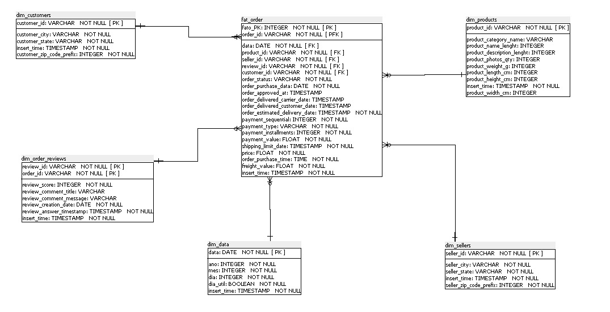
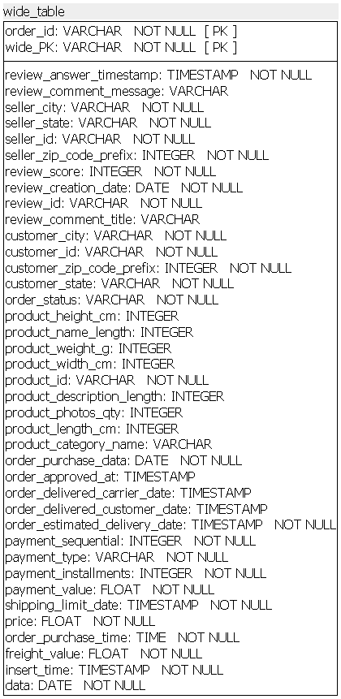

# Projeto Final - Data Prep & Transformation

## Sobre o Projeto

Este projeto teve como objetivo a criação de um pipeline de dados para transformar uma base transacional em um Star Schema e uma Wide Table, proporcionando uma estrutura otimizada para análises e consultas.

Foi utilizado o dataset da [Olist](https://www.kaggle.com/datasets/olistbr/brazilian-ecommerce?resource=download&select=olist_customers_dataset.csv), que contém 9 arquivos em formato CSV.
### Arquitetura do projeto:

## Stack utilizada

- Banco de dados Star Schema e Wide Table: PostgreSQL; 

- Carregamento dos dados: Python;

- Processamento: Python.

## Arquitetura Star Schema

Foi utilizado o Power Architect para modelar e organizar os relacionamentos necessários para a construção do Star Schema. A arquitetura ficou dividida pelas seguintes dimensões e fato:

Dimensões:
- Customers;
- Reviews;
- Products;
- Geolocation;
- Sellers;
- Data.

Fato:
- Orders.

*Foi criada a dimensão Data para facilitar e otimizar as análises temporais.*

### Arquitetura Star Schema:

Essa estrutura foi pensada para garantir flexibilidade e eficiência nas futuras análises de dados.

## Arquitetura Wide Table

Essa estrutura foi projetada para simplificar consultas e aumentar a performance analítica, consolidando dados em uma única tabela, ideal para cenários de leitura intensiva e análises rápidas.

